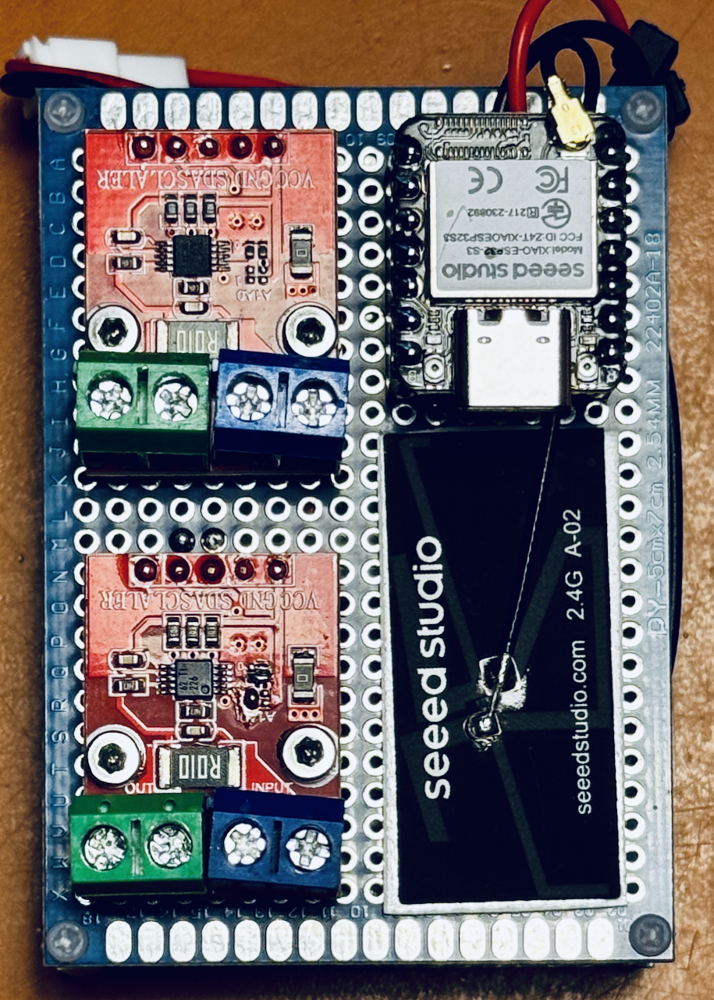
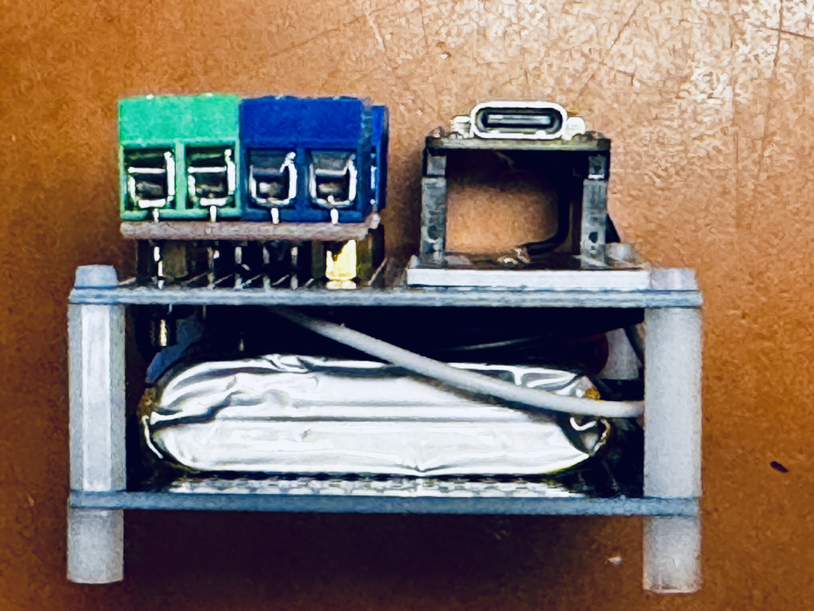

# ⚡ INA226 Monitor v2 – Mobile Strom- und Spannungsmessstation

> Autor: Paul Simmen mit Vibe (GLM-5-latest-short), 08.10.2026
> Ein «Brain-Gym»-Projekt – den Kopf fit halten mit Elektronik und Code. 🧠💪


*Die mobile Mess-Einheit: XIAO ESP32S3 mit zwei INA226-Modulen*

---

## Was ist das?

Eine zweikanalige Messstation für **Gleichspannung und Gleichstrom** (0–36 V, bis ~8 A pro Kanal), bestehend aus zwei Einheiten:

- **Mess-Einheit** (mobil, akkubetrieben): misst auf Abruf zwei Stromkreise und sendet die Werte per WLAN
- **Steuer-Einheit** (Raspberry Pi): ruft die Messungen ab, zeigt sie im **Browser-Dashboard** an (Live-Werte + Verlaufsgrafik) und zeichnet sie auf Wunsch als **CSV-Datei** auf

Eigenschaften:

| Funktion | Beschreibung |
| --- | --- |
| 2 Messkanäle | Spannung (V), Strom (mA), Leistung (W), Shunt-Spannung (mV) je Kanal |
| Messintervall wählbar | 12 s / 30 s / 60 s / 300 s – oder Sofortmessung per Knopfdruck |
| Dashboard im Browser | Live-Werte, Status der Mess-Einheit, Verlaufsgrafik (ohne Internet nutzbar) |
| CSV-Aufzeichnung | Start/Stop im Dashboard, Download als Datei, überlebt Stromausfälle |
| Verlauf persistent | Grafik zeigt nach Neustarts die letzten 600 Messpunkte weiter an |
| Autostart | Beide Einheiten starten nach Stromausfall selbstständig neu |

---

## Wie funktioniert es?

```text
                 I2C (Draht)                  WLAN / MQTT
  Verbraucher ◄── XIAO ESP32S3 ──────────────► Raspberry Pi
                 + 2× INA226   Messwerte       Mosquitto-Broker
                 (Shunt R010)  senden         + Flask-Dashboard
                                                 │
                                                 ▼
                                        Browser (Handy/Tablet/PC)
```

**Ablauf einer Messung (Pull-Prinzip):**

1. Der Pi sendet einen Trigger an `ina226/cmd`
2. Der XIAO misst beide Kanäle
3. Der XIAO sendet die Resultate an `ina226/1a` und `ina226/10a`
4. Dashboard zeigt die Werte, Grafik wächst, optional CSV-Zeile

---

## Stückliste

| Komponente | Anzahl | Bemerkung |
| --- | --- | --- |
| Seeed Studio XIAO ESP32S3 | 1 | Mikrocontroller der Mess-Einheit |
| INA226-Modul (China, 20×27 mm, Schraubklemmen, Shunt R010 = 0.01 Ω) | 2 | Lötstellen A0/A1 vorhanden; bei einem Modul umlöten (Schritt 1) |
| LiPo-Akku 3.7 V mit JST-PH-2-Pol-Stecker | 1 | An Bat+/Bat− des XIAO (Laden über USB-C) |
| Raspberry Pi (Zero 2 W oder besser) | 1 | Steuer-Einheit, headless (ohne Monitor) |
| microSD-Karte | 1 | mind. 16 GB, Class 10 |
| 5-V-Netzteil für den Pi | 1 | passender Anschluss (Micro-USB/USB-C) |
| Litze 24 AWG | 8 | I²C-Verbindung XIAO ↔ INA226-Module |
| PCB - Prototyp - Board | 2 | Befestigung div. Bauteile |
| Distanzhalter M2 | – | div. Längen |
| USB-C-Kabel | 1 | zum Flashen und Laden des XIAO |

> **Bezugsquelle INA226-Module:** gängige China-Versender, Suchbegriff «INA226 module». Wichtig: Variante **R010** (0.01 Ω Shunt) und **A0/A1-Lötstellen**.

---

## Nachbau in 6 Schritten

### Schritt 1: INA226-Module vorbereiten (Lötstellen setzen)

Beide Module haben ab Werk die I²C-Adresse **0x40** – Konflikt. Deshalb bei einem Modul die Adresse umlöten:

| Modul | A1-Lötstelle | A0-Lötstelle | I²C-Adresse | Rolle |
| --- | --- | --- | --- | --- |
| Modul A | offen lassen | offen lassen | **0x40** | Kanal 1 |
| Modul B | mit VS brücken | mit VS brücken | **0x45** | Kanal 2 |

> «Verbinden mit VS» = kleine Lötzinn-Brücke zwischen der A0- bzw. A1-Pad und der VS-Pad. Das Ergebnis lässt sich mit einem I²C-Scanner-Sketch prüfen.

### Schritt 2: Mess-Einheit verkabeln

**XIAO ESP32S3 ↔ INA226-Module:**

| XIAO-Pin | Funktion | Verbindung |
| --- | --- | --- |
| D1 (GPIO6) | SDA (I²C-Daten) | SDA beider Module |
| D2 (GPIO7) | SCL (I²C-Takt) | SCL beider Module |
| 3V3 | Versorgung | VCC beider Module |
| GND | Masse | GND beider Module |

**Messstrecke (pro Modul, an den Schraubklemmen):**

```text
Quelle (+) ──► VIN-Klemme ─[Shunt]─ VOUT-Klemme ──► Verbraucher (+)
Quelle (−) ──► GND ◄──────────────────────────── Verbraucher (−)
```

> Masse von Quelle und Verbraucher gemeinsam auf GND. Max. 36 V, ~8 A pro Kanal.

**Stromversorgung:** LiPo an Bat+/Bat− (Unterseite XIAO), Laden über USB-C.


*Seitenansicht der Station mit Schraubklemmen und Verdrahtung*

### Schritt 3: Firmware auf den XIAO flashen

1. **Arduino IDE** installieren (arduino.cc)
2. In Datei → Voreinstellungen die zusätzliche Boardverwalter-URL `https://raw.githubusercontent.com/espressif/arduino-esp32/gh-pages/package_esp32_index.json` eintragen, dann im Boardverwalter das Paket **esp32** installieren
3. Bibliothek installieren: **PubSubClient** von Nick O'Leary (Bibliotheksverwalter)
4. Sketch `messeinheit/ina226-messeinheit.ino` aus diesem Repo öffnen
5. Im Abschnitt **KONFIGURATION** anpassen:
   - `WIFI_SSID` / `WIFI_PASSWORD` → eigenes WLAN
   - `MQTT_HOST` → IP-Adresse des Raspberry Pi
6. Board **XIAO_ESP32S3** wählen, XIAO per USB-C anschliessen, **Hochladen**
7. Serieller Monitor (115200 Baud): beide Kanäle müssen mit `OK` erscheinen

### Schritt 4: Raspberry Pi einrichten

1. Mit dem **Raspberry Pi Imager** die SD-Karte mit **Raspberry Pi OS Lite (64-bit)** bespielen; im Imager Benutzer, WLAN und SSH vorkonfigurieren
2. Per SSH einloggen, dann:

```bash
sudo apt update && sudo apt full-upgrade -y
sudo apt install -y python3-pip python3-full git mosquitto mosquitto-clients

# Mosquitto-Broker konfigurieren (Heimnetz, Port 1883):
sudo tee /etc/mosquitto/conf.d/local.conf > /dev/null <<'EOF'
listener 1883
allow_anonymous true
EOF
sudo systemctl enable --now mosquitto
```

3. Software installieren:

```bash
cd ~
git clone https://github.com/Paul-3400/INA-226-monitor-v2.git
cd INA-226-monitor-v2
python3 -m venv venv
source venv/bin/activate
pip install flask paho-mqtt
```

> **Wichtig:** Die in Schritt 3 eingetragene `MQTT_HOST`-IP muss zur IP dieses Pi passen (`hostname -I` zeigt sie). Am besten im Router eine feste IP reservieren.

### Schritt 5: Funktionstest

```bash
# Terminal 1 – mithören:
mosquitto_sub -h localhost -t 'ina226/#' -v

# Terminal 2 – Messung auslösen:
mosquitto_pub -h localhost -t ina226/cmd -m '{"trigger":1}'
```

**Erwartet:**

```text
ina226/status online
ina226/1a {"voltage_V":...,"current_mA":...,"power_W":...,"shunt_mV":...}
ina226/10a {"voltage_V":...,"current_mA":...,"power_W":...,"shunt_mV":...}
```

### Schritt 6: Dashboard und Autostart

```bash
cd ~/INA-226-monitor-v2
sudo cp ina226-monitor.service /etc/systemd/system/
sudo systemctl daemon-reload
sudo systemctl enable --now ina226-monitor
```

Dashboard im Browser öffnen: `http://<Pi-IP>:5000` – fertig! 🎉

Details zur Bedienung: siehe **[Bedienungsanleitung.md](Bedienungsanleitung.md)**

---

## Fehlerbehebung

| Symptom | Mögliche Ursache / Lösung |
| --- | --- |
| Mess-Einheit zeigt «offline» | XIAO ohne Strom? WLAN nicht erreichbar? Nach Einschalten erscheint «online» innert Sekunden |
| Keine Messwerte trotz Trigger | `MQTT_HOST` in der Firmware stimmt nicht → IP prüfen, neu flashen |
| «INA226 Kanal: FEHLER» im seriellen Monitor | A0/A1-Lötstellen oder Verdrahtung prüfen; Adressen mit I²C-Scanner kontrollieren |
| Strom ≈ 0 trotz Last | Verbraucher über die Schraubklemmen angeschlossen? (Strom fliesst durch den Shunt, nicht über Dupont-Kabel) |
| Dashboard nicht erreichbar | Service läuft? `systemctl status ina226-monitor` |
| Werte weichen ab | Kalibrierung prüfen: bekannte Last messen und mit Referenzmessgerät vergleichen |

---

## Dokumentation

| Dokument | Inhalt |
| --- | --- |
| [Bedienungsanleitung.md](Bedienungsanleitung.md) | Inbetriebnahme, Bedienung, alle wichtigen Befehle |
| [Handover.md](Handover.md) | Projektgeschichte, Architektur-Entscheide, aktueller Stand |
| [messeinheit/README.md](messeinheit/README.md) | Details zur Firmware der Mess-Einheit |

## Sicherheitshinweis

Privates Bastelprojekt zum Nachbauen – Benutzung auf eigene Verantwortung. Schraubklemmen nie unter Last anschliessen oder lösen; bei Spannungen über 30 V gelten die einschlägigen Vorsichtsmassnahmen.
